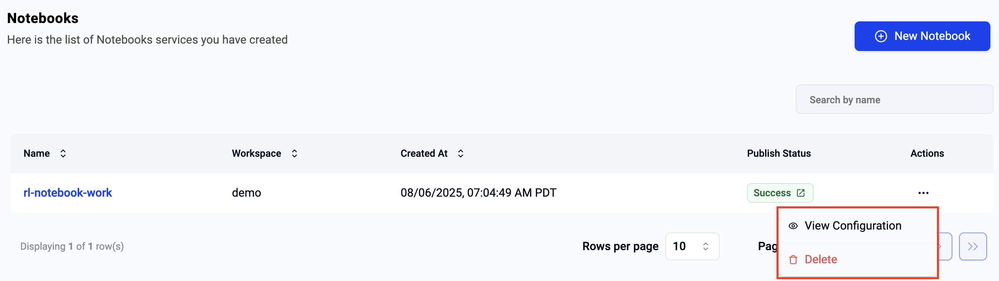

It is extremely common for data scientists and researchers to use Jupyter notebooks for exploratory data analysis. Users can configure, deploy and use notebooks preloaded with the required libraries and frameworks in seconds. 

---

## Create Notebook

Click on **New Notebook** to create a new notebook. 

---

## Configure Notebook

As a first step, provide a name for the notebook and select the workspace where you would it to be deployed. 

--- 

### Notebook Resources 

Now, specify the GPU resources you would like to provide the notebook. Select from the provided options:

- Number of GPUs
- GPU Model/Type (i.e. node type)

--- 
### Notebook Profiles

A notebook profile maps to a notebook pre-installed and pre-configured with the required frameworks, libraries and software add-ons that match the profile. Profiles allow the data scientist to start using the notebook right away instead of wasting time trying to install and configure all the software on top of the notebook.

| Profile               | Description                               |
|-----------------------|-------------------------------------------|
| Minimal               | Basic libraries and frameworks only       |
| Data Science          | With common libraries for data science    |
| Spark                 | With libraries required for Spark         |
| Tensorflow            | With Tensorflow libraries                 |
| Tensorflow with CUDA  | With Tensorflow and CUDA libraries        |
| PyTorch               | With PyTorch libraries                    |
| PyTorch with CUDA     | With PyTorch and CUDA libraries           |

Select the profile you would like to use with your notebook from the provided dropdown list. 

---

## View Notebooks

Clicking on the notebooks menu will list of all the notebooks the user has access to. Note that notebooks may be deployed to different workspaces. To view details about a specific notebook, users just need to click on the name of the notebook.

---

## Use Notebook

Once a notebook has been successfully deployed, the user can access and use it. They are presented with the **URL for the notebook** and a **token (authentication credentials)** to securely access the notebook. To access the notebook, the user can either click on the URL or copy/paste it into a web browser.

!!! info
    Users need to provide the access token as a credential before they can access the Jupyter notebook.

---

## Delete Notebook

To delete a notebook, users should click on the ellipses on the far right of the selected notebook and select delete.

!!! info
    Once deletion has been initiated, it cannot be stopped or reversed. Users can create a new notebook if required.

---
