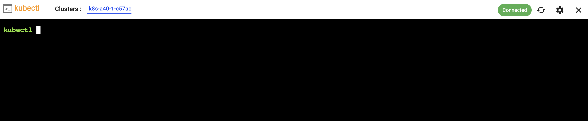

Users can configure, deploy and remotely access/use managed kubernetes clusters. 

---

## Create Cluster

To create a new Managed Kubernetes Cluster, select the option from the menu on the left. 

--- 

## Configure Cluster

Users need to provide a **name** for the Kubernetes Cluster and select the **workspace** they would like to deploy it in. 

- Select from available GPU Models
- Select total number of nodes in cluster

Users are provided with a real time cost estimate based on the selected configurations. 

!!! info
    Managed Kubernetes Clusters are metered by the hour with a minimum usage of 1 hour. 

--- 

## View Clusters

Users can have multiple managed Kubernetes clusters at any given time. By selecting the Kubernetes clusters menu on the left, they can view the list of all the clusters spanning all workspaces. 

---

## Access Kubernetes Cluster

In order to access a managed Kubernetes cluster, click on its name and you will be presented with a view like the example below. 

--- 

### Download Kubeconfig

Users do not require any form of SSH access to remotely and securely access their Managed Kubernetes clusters using the zero trust kubectl access proxy. Click on "Download Kubeconfig" to download the kubeconfig file to be used with the Kubectl CLI. 

--- 

### Utilities 

A number of browser based, integrated utilities are provided for users to remotely view resources on the remote Kubernetes cluster. 

#### Kubernetes Resources Dashboard 

An integrated Kubernetes Resources Dashboard is available for users. This provides a real time and detailed view into **All Kubernetes Resources** on the Kubernetes cluster. Users can search, sort and view the data based on criteria that makes most sense for them. The console provides a number of filters to make this easy for them. Also, users can view the resource(s) count displayed at the top.

---

#### Utilization Dashboard 

Every managed Kubernetes cluster is deployed with "monitoring addons". These provide access to deep cluster insights and time series visualization data. Metrics are scraped and stored in a centralized "time series database". Summary and Trend data is then made available to users via easy to use dashboards.

The utilization dashboard provides at a glance information such as insight into health, resource utilization and status of pods and workloads.

--- 

#### Kubectl (Zero Trust Access)

This provides secure, centralized kubectl access based on a zero trust, proxy based architecture. This eliminates the need for VPNs and bastion hosts while maintaining complete security, auditability, and performance for Kubernetes API access. 

---

## Delete Cluster

To delete a Managed Kubernetes Cluster, click on the ellipses on the far right of the selected cluster and select delete.

!!! info
    Once deletion has been initiated, it cannot be stopped or reversed. Users can create a new cluster if required.

---
