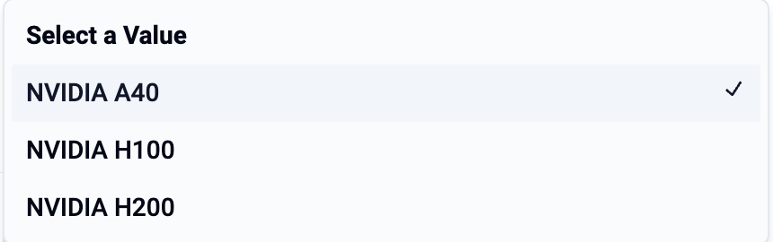
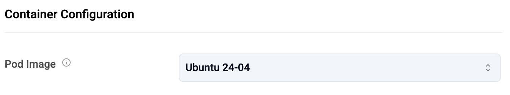
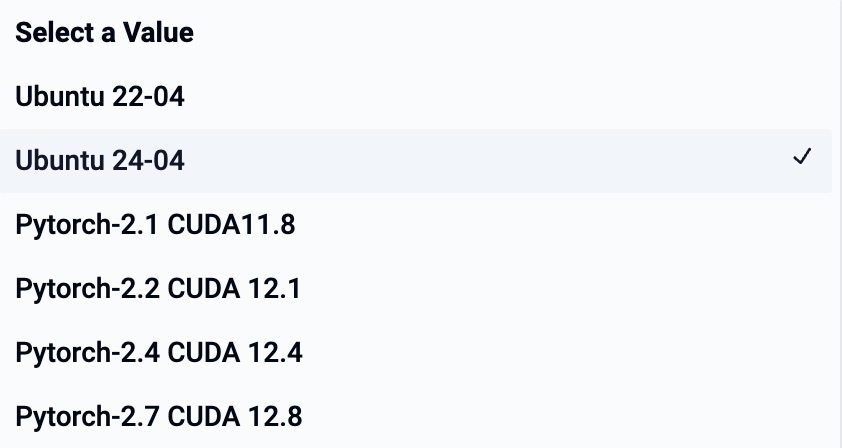
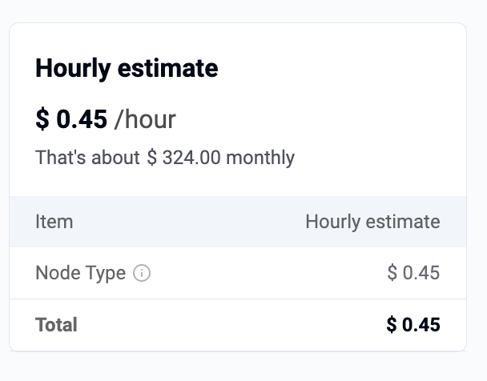
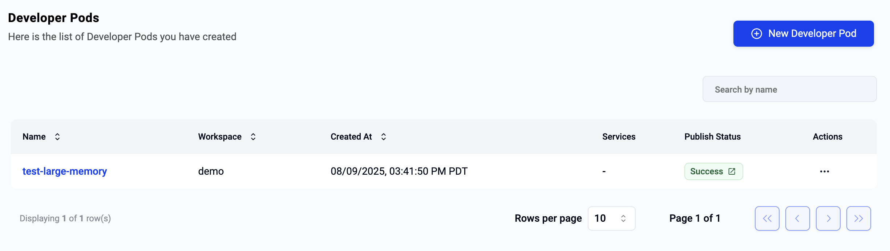
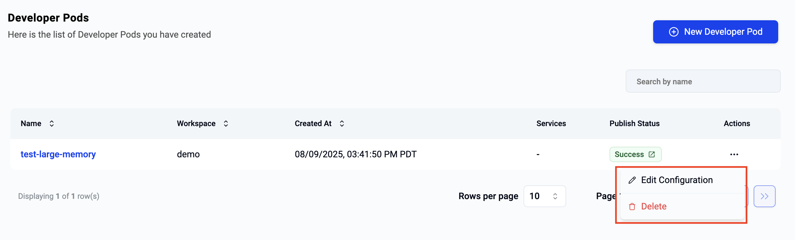

Users can use Serverless Pods to deploy custom containers from prebuilt templates in isolated environments enabling them to efficiently run CPU and GPU-intensive tasks without managing physical infrastructure.

---

## Create Pod

To create a new Pod, select the option for Pods

--- 

## Configure Pod

Users need to provide a **name** for the pod and select the **workspace** they would like to deploy the pod into. 

--- 

### Resources 

Users can specify CPU, Memory, Number of GPUs and model of GPU they would like use with their pod.

Users can select the GPU Model they would like to use from the dropdown. 

--- 

### Select Pod Image

Pods can come **pre-installed** with frameworks and libraries. This allows the data scientist to start using the Pod right away instead of wasting time trying to install and configure all the software on top and struggling with versioning etc. 

Users can select from the list of available Pod Images displayed in the dropdown. 

---

### Cost Estimate 

Users are provided with a real time cost estimate based on the selected configurations. 

!!! info
    Pods are metered by the hour with a minimum usage of 1 hour. 

--- 

## View Pods

Users can have multiple pods at any given time. By selecting the Pods menu on the left, they can view the list of all pods across all their workspaces. 

---

## Use/Access Pod

In order to access a pod, click on its name and you will be presented with a view like the example below. Users can access the Pods from their laptops using SSH. 

--- 

### Download SSH Credentials 

Copy the first command and paste it on your terminal. This will automatically create a new file with details of the private key and update the file permissions for use with SSH. 

--- 

### SSH based Access

Copy the second command and paste it on your terminal to access the pod via SSH. 

---

## Delete Pod

To delete a pod, users should click on the ellipses on the far right of the selected pod and select delete.

!!! info
    Once deletion has been initiated, it cannot be stopped or reversed. Users can create a new pod if required.

---
