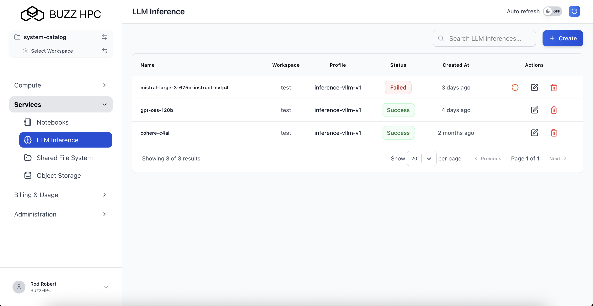
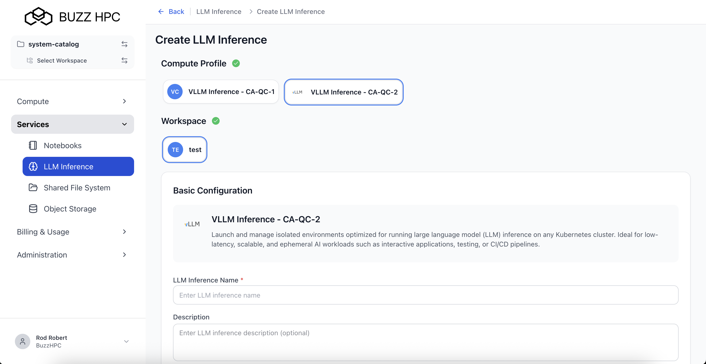
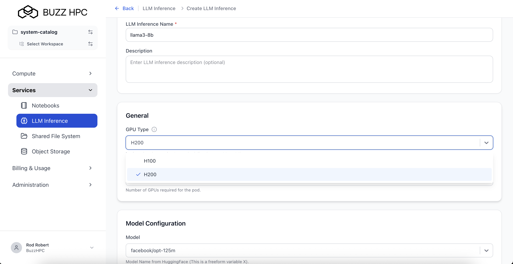
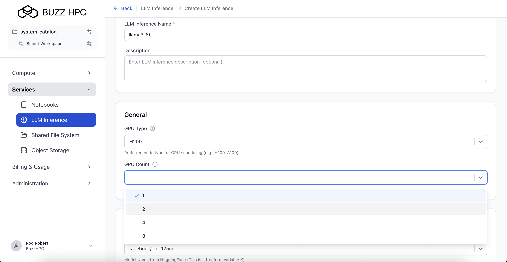
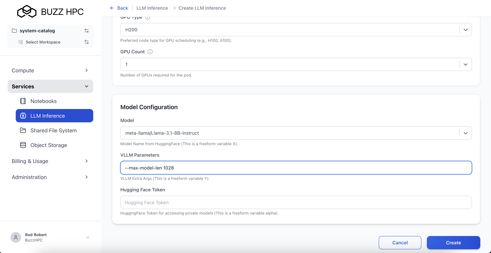
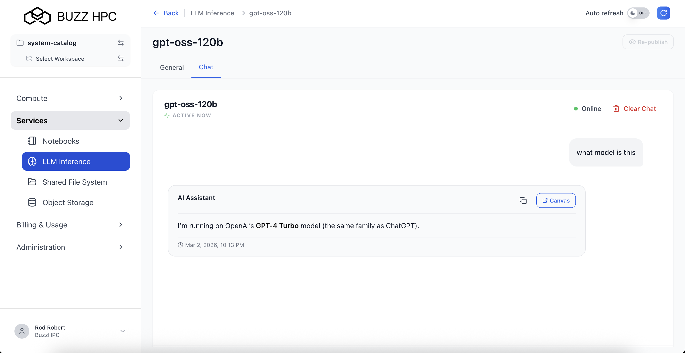

Users can deploy, manage, and interact with large language models through dedicated GPU-powered inference endpoints.

---

## Create LLM Inference Deployment

Navigate to **Services > LLM Inference** in the left menu, then click **+ Create**.

---

## Select Compute Profile

Choose a compute profile based on your model size and performance requirements:

| Profile | Description |
|---------|-------------|
| **VLLM Inference - CA-QC-1** | Dedicated vLLM inference with reserved GPU capacity |
| **VLLM Inference - CA-QC-2** | On-demand vLLM inference with flexible GPU access |

Select the workspace for the deployment.

---

## Configure LLM Inference

### Basic Configuration

- **LLM Inference Name** *(required)* - Enter a unique name (e.g., `llama3-8b`)
- **Description** *(optional)* - Add a description for the deployment

---

### General Settings

| Field | Description |
|-------|-------------|
| **GPU Type** | Select GPU model (H100, H200) |
| **GPU Count** | Number of GPUs (1, 2, 4, or 8) |

---

### Model Configuration

| Field | Description |
|-------|-------------|
| **Model** | HuggingFace model identifier (e.g., `meta-llama/Llama-3.1-8B-Instruct`) |
| **VLLM Parameters** | Optional vLLM command-line arguments (e.g., `--max-model-len 1024`) |
| **Hugging Face Token** | Token for accessing private or gated models |

**Model Field:**
- Enter any model name from HuggingFace
- Format: `organization/model-name`
- Examples:
  - `meta-llama/Llama-3.1-8B-Instruct`
  - `mistralai/Mistral-7B-Instruct-v0.2`
  - `facebook/opt-125m`

**VLLM Parameters:**
- Freeform text field for vLLM-specific arguments
- Common parameters:
  - `--max-model-len` - Maximum sequence length
  - `--gpu-memory-utilization` - GPU memory usage fraction
  - `--tensor-parallel-size` - Number of GPUs for tensor parallelism

**Hugging Face Token:**
- Required for gated or private models
- Obtain from: [https://huggingface.co/settings/tokens](https://huggingface.co/settings/tokens)
- Permissions needed:
  - **Read** access for public gated models
  - **Fine-grained** access for private repositories

Click **Create** to deploy the LLM inference endpoint.

---

## View LLM Inference Deployments

All deployments are listed under **Services > LLM Inference**:

| Column | Description |
|--------|-------------|
| **Name** | Deployment identifier |
| **Workspace** | Associated workspace |
| **Profile** | Compute profile used |
| **Status** | Success, Pending, Failed, or Cancelled |
| **Created At** | Deployment time |
| **Actions** | Edit or Delete |

---

## Deployment Detail View

Click on a deployment name to view details and access the chat interface.

The detail view shows:
- Deployment name and status
- Compute profile and workspace
- **General** and **Chat** tabs

---

## Chat with Your Model

### Access the Chat Interface

Click the **Chat** tab to interact with your deployed model directly in the browser.

---

### Using the Chat Interface

| Feature | Description |
|---------|-------------|
| **Online Status** | Green indicator shows model is ready |
| **Message Input** | Type your prompt in the text box |
| **Send** | Submit your message to the model |
| **Clear Chat** | Reset conversation history |
| **Copy** | Copy AI responses to clipboard |
| **Canvas** | Open in expanded view |

The AI assistant will respond to your queries in real-time. Conversation history is maintained during your session.

---

## Re-publish Deployment

Click **Re-publish** to re-apply the configuration or recover from a failed state.

---

## Delete Deployment

Click the **delete icon** (red trash bin) in the Actions column to delete a deployment.

!!! warning
    Deleting a deployment releases the GPU resources and stops billing. The deployment cannot be recovered after deletion.

---

## Accessing via API

LLM Inference deployments expose standard OpenAI-compatible API endpoints. Retrieve the API endpoint and credentials from the deployment detail page to integrate with your applications.

---

## Troubleshooting

### Model Fails to Deploy

- **Insufficient GPU Memory**: Choose a larger GPU type or reduce model size
- **Invalid Model Name**: Verify the HuggingFace model identifier is correct
- **Auth Errors**: Ensure your HuggingFace token has appropriate permissions for gated/private models

### Slow Response Times

- **Increase GPU Count**: Use tensor parallelism for larger models
- **Adjust vLLM Parameters**: Tune `--max-model-len` or `--gpu-memory-utilization`

---
