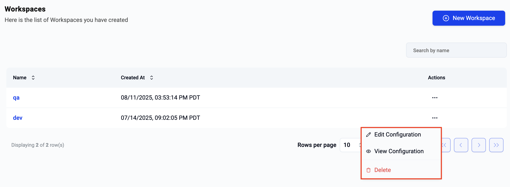

End users can use workspaces to **group and organize** resources they create. For example, a data scientist may wish to create two workspaces called "dev" and "qa". They can then create compute resources etc in these workspaces. 

Workspaces are also a way to achieve **multi tenancy** and **isolation** in collaborative environments allowing users to invite collaborators to specific workspaces. In the example below, you can see that the data scientist "John" has invited "Sally" to collaborate with him only in the "dev" workspace. Although Sally can access all resources inside the Dev workspace, she cannot view/access any resources inside the "qa" workspace. 

In summary, workspaces help end users achieve the following:

- Group and Organize Resources
- Collaboration with Isolation and Multi Tenancy for End User Resources

!!! info
    Although here is no limit to the number of workspaces users can create, a practical number may be 3-5 workspaces. 

---

## Workspace Lifecycle 

### Create Workspace

To create a workspace, login and click on the workspaces menu. Users can either click on **View All** to access the Workspaces page or click on **New Workspace** to create a new workspace. 

On clicking New Workspace, provide the required details:

- Name: Unique name for the workspace (e.g., qa-dept)
- Display Name:User-friendly name for the workspace (e.g., "Project QA")
- Description: Brief summary of the workspace’s purpose
- Labels: Key-value pairs for categorizing the workspace (e.g., env: dev)
- Annotations: Additional key-value metadata for the workspace (e.g., owner: JohnDoe)

---

### View Workspace

When the user selects the workspaces menu on the left, the list of all workspaces will be displayed. Users can view additional details (e.g. when was it created? when was it last modified) about a workspace by clicking on a specific workspace.

If the user has a large number of workspaces, they can "search" for the workspace by entering either a partial or full name in the search box. This will display a filtered list of all workspaces that matched the search criteria.

---

### Edit Workspace

To modify the workspace, click on the ellipses on the far right of the workspace to bring up the **actions** menu. Select "edit configuration", make the necessary changes and save the workspace.

--- 

### Delete Workspace

To delete a workspace, click on the ellipses on the far right of the workspace to bring up the **actions** menu. Select "delete" 

---

## Add/Remove Collaborators

To add collaborators to a workspace, click on the workspace or click on **View Configuration**. This will display additional details about the workspace. In the collaborators section, you will see a list of users that have access to the workspace with their roles (i.e. privileges describing what they can/cannot do in the workspace).

### Add Collaborator

To invite new collaborators to the workspace,

- Click on **Add Collaborator** and select the user from the popup list. 
- Click **Save**

### Remove Collaborator

To remove a user from a workspace, click on the "ellipses" on the far right of the user row and click on "actions" and select "delete".

---